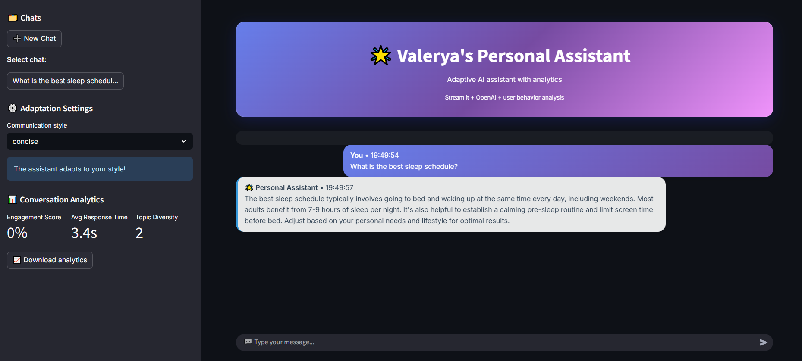

# Valerya's Personal Assistant

An interactive AI assistant for customer support with user-adaptive analytics and a modern UI.

**You can try the app online (no API key needed):**
[https://valeryaspersonalassistant.streamlit.app](https://valeryaspersonalassistant.streamlit.app)

## Features
- Modern UI (Streamlit + custom CSS)
- Adapts to user's communication style
- Engagement, topic, and conversation depth analytics
- Visualization of metrics and analytics export
- OpenAI integration (gpt-4o-mini)
- Modular architecture and basic tests

## Quick Start
You can test the app online without an API key:
[https://valeryaspersonalassistant.streamlit.app](https://valeryaspersonalassistant.streamlit.app)

Or run locally:
1. Clone the repository and navigate to the project folder
2. Install dependencies:
   ```
   pip install -r requirements.txt
   ```
3. Set your OpenAI API key in `.env`:
   ```
   OPENAI_API_KEY=your-key-here
   OPENAI_MODEL=gpt-4o-mini
   ```
4. Run the app:
   ```
   streamlit run main.py
   ```

## Project Structure
- `main.py` — entry point, UI, chat logic
- `analyzer.py` — topic, style, and engagement analysis
- `ai_client.py` — OpenAI API integration
- `ui.py` — analytics and chat visualization
- `test_analyzer.py` — basic tests
- `.gitignore` — excludes secrets, venv, and temp files

## Screenshots



## License
MIT 